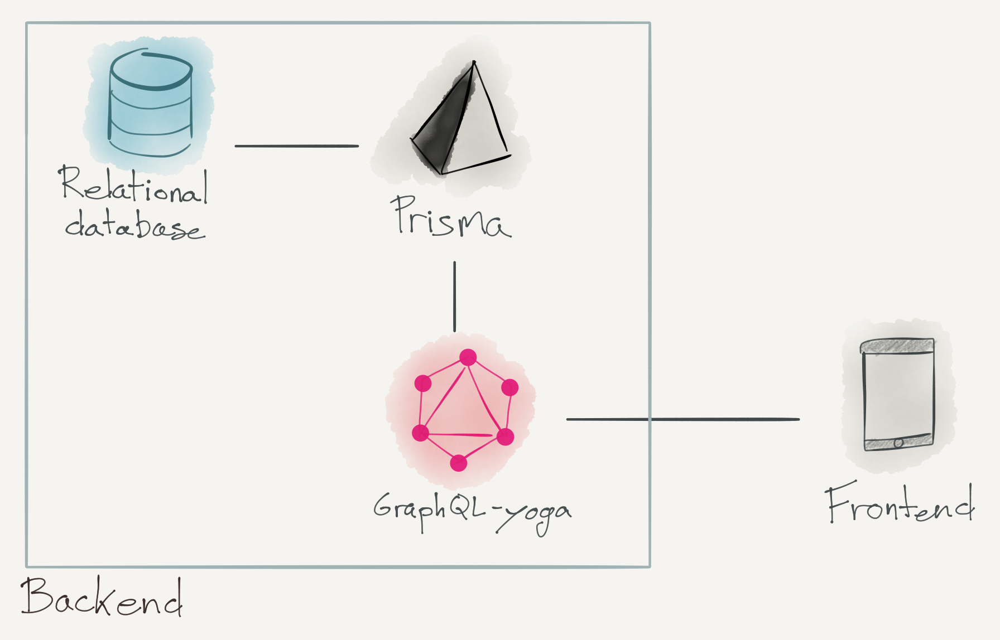

# Wobbly backend    

The GraphQL backend server for [Wobbly](https://wobbly.app), written in TypeScript and based on Apollo Server.

## Features

- **Static type generation**: TypeScript types for GraphQL queries & mutations are generated in a build step
- **GraphQL database:** Includes GraphQL database binding to [Prisma](https://www.prismagraphql.com) (running on Postgres)
- **Tooling**: Out-of-the-box support for [GraphQL Playground](https://github.com/prisma/graphql-playground) & [query performance tracing](https://github.com/apollographql/apollo-tracing)
- **Extensible**: Simple and flexible [data model](./prisma/datamodel.prisma) – easy to adjust and extend
- **Realtime updates**: Support for GraphQL subscriptions

## Structure

[Prisma](https://www.prisma.io/) is a GraphQL ORM ([object-relational mapping](https://en.wikipedia.org/wiki/Object-relational_mapping)). It gives us a way to interact with the raw data in our database through GraphQL -- but note that this is not the same GraphQL API that is exposed to front-end clients. Our prisma code lives in the [`prisma/` directory](./prisma/). The [Prisma datamodel](./prisma/datamodel.prisma) defines the tables in our database.

Instead, we use [Apollo Server](https://github.com/apollographql/apollo-server) as our "main" backend server. This is where we implement the resolvers for our own GraphQL API. The code for this lives in the [`src/` directory](./src/). This is also where you'll find the [schema](./src/schema.graphql) for our public API.

The Prisma server and our backend server can live on different machines, or the same.

## Getting started

### Requirements

- TypeScript
- Docker
- docker-compose

### Steps

- `cp example.env .env`.
  - `NODE_ENV` is the node environment (e.g. `dev`, `production`, etc.). It's also the [stage](https://www.prisma.io/forum/t/what-is-the-purpose-of-prisma-service-and-stage-in-the-prisma-yml/4699) on the Prisma server.
  - `ENGINE_API_KEY` is the API key for [Apollo Engine](https://engine.apollographql.com). Don't worry if you don't have this API key; you don't need it. Apollo Engine gives us statistics on production server performance but you don't need it for development.
  - `PORT` is the port that exposes the public API.
  - `PRISMA_ENDPOINT` is where the Prisma server lives. It's a URL of the format `http://domain:port/service`. The `service` is the name of the service. If you're running Prisma locally with docker, this should be `http://localhost:4466/wobbly`. **Make sure it does not end in a slash.**
  - `PRISMA_SECRET` should be a long, secret string for authenticating against Prisma when using the GraphQL playground in the browser.
  - `PRISMA_MANAGEMENT_API_SECRET`
  - `DB_USER` and `DB_PASSWORD` are the credentials to connect to the Postgres database.
  - `APP_SECRET` is the secret we use to sign user [JWTs](https://en.wikipedia.org/wiki/JSON_Web_Token).
- `yarn codegen` generates a) the typed Prisma client and b) types for the front-facing schema
- You have two options for running the Prisma server:
  - If you want to get started quickly, run `yarn prisma init` to set up a remote Prisma demo server and set it as your `PRISMA_ENDPOINT`.
  - If you want to run a local Prisma server, e.g. if you're offline:
    - `docker-compose -f docker-compose.yml -f docker-compose-dev.yml up -d` starts a Postgres db and a Prisma server.
- `yarn prisma deploy` deploys the Prisma datamodel to the Prisma server
- `yarn dev` runs the backend server locally.

## Development workflows

### Testing
- `yarn test:deployschema` deploys the current Prisma datamodel to the `test` stage on Prisma.
- `yarn test:resetdb` resets the `test` stage (i.e. clears its data and re-seeds from `seed.graphql`).
- `yarn test` runs all tests.

If the `auth` test suite fails, run `yarn test:resetdb` before running tests again. This is because the suite
creates a temporary test account that it only deletes at the end, and if this test account already exists, tests fail.

### Updating the datamodel

- `yarn prisma generate` takes the Prisma datamodel and generates the code to interact with our DB (i.e. the code that lives in `./src/generated/prisma-client/`).
- `yarn prisma deploy` deploys the updated datamodel on the Prisma server (and also calls `prisma generate`).
- You can visit `$PRISMA_ENDPOINT/$NODE_ENV` to interact with the Prisma API through the GraphQL playground. Note that you'll need to run `yarn prisma token` to get an authorization token to access this endpoint. Then set a header like `Authorization: Bearer $TOKEN`.

### Updating the public schema

- After updating `schema.graphql`, run `yarn codegen` to generate the types for our resolvers. This runs [graphqlgen](https://github.com/prisma/graphqlgen).
- Write your resolvers.
- If you've set the `ENGINE_API_KEY` environment variable, run `apollo service:push --endpoint=http://localhost:4000` to push the new schema to Apollo Engine (while the local server is running).

### Pull requests

- All CI checks must pass for PRs to be merged.
- One of these checks makes sure that a new entry was added to `CHANGELOG.md`. If you don't think your PR requires a changelog entry, use the string `#trivial` somewhere in your PR title or body. Then you'll override this check.

## Deployment workflows

- Merging into `develop` automatically deploys to our dev stack on Heroku.
- When setting up a new stack, be sure to create an index on the Group table to enable fast full-text search:
  - Something like `CREATE INDEX group_idx ON wobbly$production."Group" USING GIN (to_tsvector('english', name || ' ' || description));`
  - Make sure that `to_tsvector` in this command has the same number of arguments as in our resolver, otherwise the index won't work. (i.e. if you explicitly specify `'english'`
    in one, you should also do it in the other).

## Documentation

### Commands

- `yarn dev` starts a GraphQL server on `http://localhost:4000`
- `yarn prisma <subcommand>` gives access to local version of Prisma CLI (e.g. `yarn prisma deploy`)
